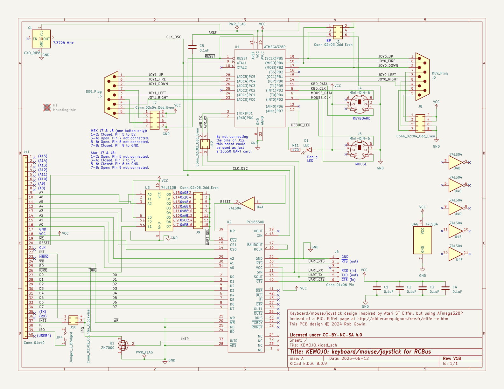

# KEMOJO (Keyboard / Mouse / Joystick)

This board provides PS/2 keyboard, PS/2 mouse and Atari or MSX (single
button only) joystick support for an RCBus system. It uses the 40-pin
RCBus interface. 

The keyboard, mouse and joystick inputs are read by an ATmega 328P
microcontoller. (This is the same MCU that is in the Arduino UNO.) The
ATmega implements the [Atari ST IKBD
protcol](https://archive.org/details/Intelligent_Keyboard_ikbd_Protocol_Feb_26_1985/)
and communicates that protocol serially to an RCBus system via a
16C550 UART.

## Table of Contents
* [Hardware Documentation](#hardware-documentation)
  * [Schematic](#schematic)
  * [Connectors](#connectors)
  * [Jumpers](#jumpers)
  * [Bill of Materials](#bill-of-materials)
* [Firmware Documentation](#firmware-documentation)
* [Acknowledgements](#acknowledgements)

## Hardware Documentation

### Schematic

Click the image to download a PDF version of the schematic.

### Gerbers

Gerber files are available [here](https://raw.githubusercontent.com/codesmythe/KEMOJO/refs/heads/main/hardware/KEMOJO_V1B.zip)

### Connectors

| Reference | Description                                                  |
| --------- | ------------------------------------------------------------ |
| J1        | In-system Programming (ISP) port for programming the ATmega328P firmware. |
| J2        | Atari or MSX Joystick 0, Male DE9 D-Sub. See J7 jumper settings below. |
| J3        | Atari or MSX Joystick 1, Male DE9 D-Sub. See J8 jumper settings below. |
| J4        | PS/2 6-pin Mini DIN connector for PS/2 keyboard.             |
| J5        | PS/2 6-pin Mini DIN connector for PS/2 mouse.                |
| J6        | [FTDI Friend](https://www.adafruit.com/product/284) connection to 16C550 UART. For debug purposes or UART-only operation. |

### Jumpers

| Reference | Description                             | Comment                                                      |
| --------- | --------------------------------------- | ------------------------------------------------------------ |
| J7, J8    | Atari or MSX operation for Joystick 1/0 | The J7 and J8 jumper blocks configue Joystick 1 and Joystick 0, respectively, for either Atari or MSX joystick operation. In MSX mode, only one fire button is supported. To configure a jumper block for Atari mode, close the top and bottom jumpers, and leave the middle two open. For MSX mode, close the middle two jumpers and leave the top and bottom jumpers open. |
| J9        | I/O Address decode                      | The J9 jumper block controls where in the Z80 I/O space the KEMOJO board will appear. The TL16C550 UART that communicates with the ATmega328 requires eight I/O addresses, and can be configured to appear at I/O addresses 0x08-0x0F, 0x28-0x2F, 0x48-0x4F, 0x68-0x6F, 0x88-0x8F, 0xA8-0xAF, 0xC8-0xCF or 0xE8-0xEF. |
| J10       | Interrupt connection to RCBus           | The board can generate a single interrupt from the TL16C550 UART. Jumper the top two pins of J10 to use the /INT RCBus signal (pin 22) or the bottom two pins to use the RCBus USER1/INT1 signal (pin 37). |
| JP4       | IEx bypass                              | When the JP4 jumper is closed, the RCBus-Z80 IEI signal (pin 37) is connected directly to the IEO signal (pin 38). When closed, the board is disconnected from RCBus pins 37 and 38. The KEMOJO board does not use IEI or IEO. This jumper is provided to propagate the IEI/IEO daisy chained if required by the system. |

### Bill of Materials

[Text file parts list](hardware/KEMOJO_mouser.txt) for pasting into the [Mouser BOM tool](https://www.mouser.com/Bom/Upload) (login required).

Check out the [interactive BOM](https://htmlpreview.github.io/?https://raw.githubusercontent.com/codesmythe/KEMOJO/refs/heads/main/hardware/bom/ibom_V1B.html)
for the board.

| Component Type     | Reference      | Qty | Description                                | Part                                                                                     |
| ------------------ | -------------- | --- | ------------------------------------------ | ---------------------------------------------------------------------------------------- |
| Capacitor          | C1,C2,C3,C4,C5 |   5 | 0.1 uF, MLCC, 5 mm Pitch                   | Mouser [594-K104K15X7RF5WH5](https://www.mouser.com/ProductDetail/594-K104K15X7RF5WH5)   |
| Diode              | D1             |   1 | 3 mm, yellow LED indicator                 | Mouser [859-LTL-4251N](https://www.mouser.com/ProductDetail/859-LTL-4251N)               |
| Jumper             | J1             |   1 | 2x3 straight pin header                    | Mouser [200-TSW10307TD](https://www.mouser.com/ProductDetail/200-TSW10307TD)             |
| Jumper             | J2,J3          |   2 | D-Sub DE9 Male, right angle, PCB mount     | Mouser [523-L7SDE9PA4CH4RC39](https://www.mouser.com/ProductDetail/523-L7SDE9PA4CH4RC39) |
| Jumper             | J4,J5          |   2 | Circular 6-pin Mini Din Connector for PS/2 | Mouser [490-MD-40SM](https://www.mouser.com/ProductDetail/490-MD-40SM)                   |
| Jumper             | J6             |   1 | 1x6 right angle pin header                 | Mouser [737-PH1RB-06-UA](https://www.mouser.com/ProductDetail/737-PH1RB-06-UA)           |
| Jumper             | J7,J8          |   2 | 2x4 straight pin header                    | Mouser [200-TSW10407TD](https://www.mouser.com/ProductDetail/200-TSW10407TD)             |
| Jumper             | J9             |   1 | 2x8 straight pin header                    | Mouser [200-TSW10807TD](https://www.mouser.com/ProductDetail/200-TSW10807TD)             |
| Jumper             | J10            |   1 | 2x2 straight pin header                    | Mouser [200-TSW10207TD](https://www.mouser.com/ProductDetail/200-TSW10207TD)             |
| Jumper             | J11            |   1 | 1x40 right angle pin header                | Mouser [710-61304011021](https://www.mouser.com/ProductDetail/710-61304011021)           |
| Jumper             | J12            |   1 | 2x2 straight pin header                    | Mouser [200-TSW10207TD](https://www.mouser.com/ProductDetail/200-TSW10207TD)             |
| Jumper             | JP4            |   1 | 1x2 straight pin header                    | Mouser [200-TSW10207TS](https://www.mouser.com/ProductDetail/200-TSW10207TS)             |
| Transistor         | Q1             |   1 | 2N7000  MOSFET in TO92                     | Mouser [512-2N7000](https://www.mouser.com/ProductDetail/512-2N7000)                     |
| Resistor           | R11            |   1 | 470 ohm, axial, 1% tolerance, 1/4 W        | Mouser [603-MFR-25FTF52-470R](https://www.mouser.com/ProductDetail/603-MFR-25FTF52-470R) |
| Integrated Circuit | U1             |   1 | ATmega328P MCU in 28-pin DIP               | Mouser [556-ATMEGA328P-PU](https://www.mouser.com/ProductDetail/556-ATMEGA328P-PU)       |
| Integrated Circuit | U2             |   1 | TL16C550 UART in 44-pin PLCC               | Mouser [595-TL16C550CFNR](https://www.mouser.com/ProductDetail/595-TL16C550CFNR)         |
| Integrated Circuit | U3             |   1 | 74LS138 in 16-pin DIP                      | Mouser [595-SN74LS138NE4](https://www.mouser.com/ProductDetail/595-SN74LS138NE4)         |
| Integrated Circuit | U4             |   1 | 74LS04 in 14-pin DIP                       | Mouser [595-SN74LS04NE4](https://www.mouser.com/ProductDetail/595-SN74LS04NE4)           |
| Oscillator         | X1             |   1 | 7.3278 MHz can oscillator in 8-pin DIP     | Mouser [774-MXO45HS-3C-7.3](https://www.mouser.com/ProductDetail/774-MXO45HS-3C-7.3)     |
| Socket             | Socket for U1  |   1 | 28-pin DIP socket                          | Mouser [737-ICS-328-T](https://www.mouser.com/ProductDetail/737-ICS-328-T)               |
| Socket             | Socket for U2  |   1 | 44-pin PLCC socket                         | Mouser [575-944424](https://www.mouser.com/ProductDetail/575-944424)                     |
| Socket             | Socket for U3  |   1 | 16-pin DIP socket                          | Mouser [571-1-2199298-4](https://www.mouser.com/ProductDetail/571-1-2199298-4)           |
| Socket             | Socket for U4  |   1 | 14-pin DIP socket                          | Mouser [571-1-2199298-3](https://www.mouser.com/ProductDetail/571-1-2199298-3)           |
| Socket             | Socket for X1  |   1 | 8-pin oscillator socket                    | Mouser [535-1108800](https://www.mouser.com/ProductDetail/535-1108800)                   |

## Acknowledgements

This project has initially inspired by the [Atari ST Eiffel 3](http://didier.mequignon.free.fr/eiffel-e.htm)
project. I've replaced the PIC microcontroller in that project with
an easier-to-use ATmega 328P.

The low-level PS/2 code watches the PS/2 keyboard and mouse clock
lines for transitions and signals an interrupt the ATmega. This code
then reads in PS/2 bytes and buffers them. It was written by Daniel
Cliche (@danodus) and is made available by him under an MIT license
from [here](https://github.com/danodus/rosco_m68k_io).

The higher level code that implements the Atari ST IKDB protocol is
borrowed from the [Hatari](https://www.hatari-emu.org) Atari ST
emulator. It is made available under the GNU GPL, version 2 or higher. 

The overall project thus uses the GNU GPL, version 2 or higher.
